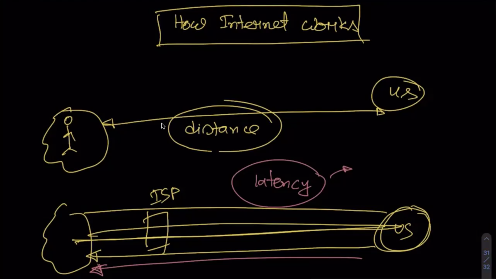

## What is network latency?
Latency is a measure of delay.  In a network, latency measures the time it takes for some data to get to its destination across the network

details: [Latency](https://www.sas.co.uk/blog/what-is-network-latency-how-do-you-use-a-latency-calculator-to-calculate-throughput)

