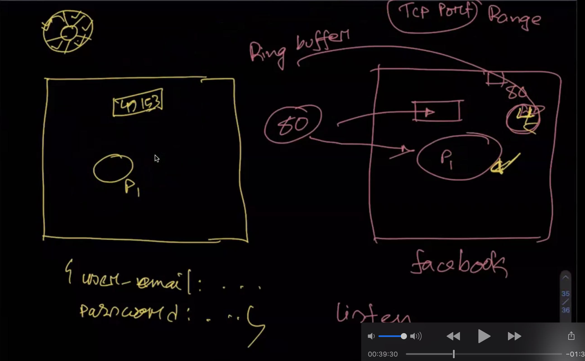
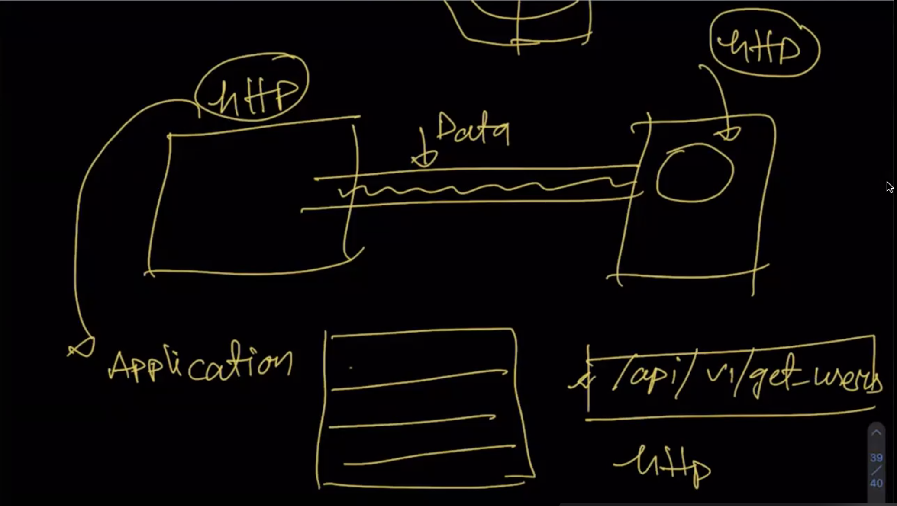
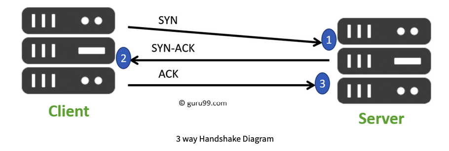
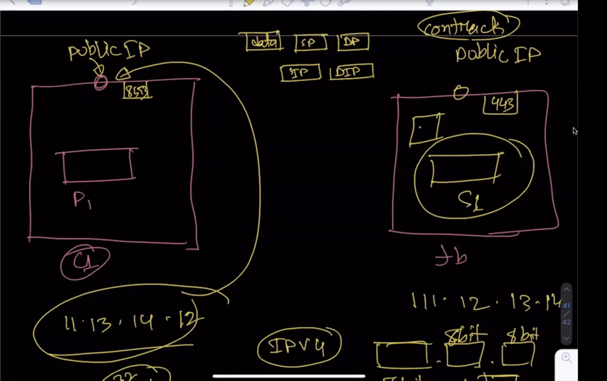
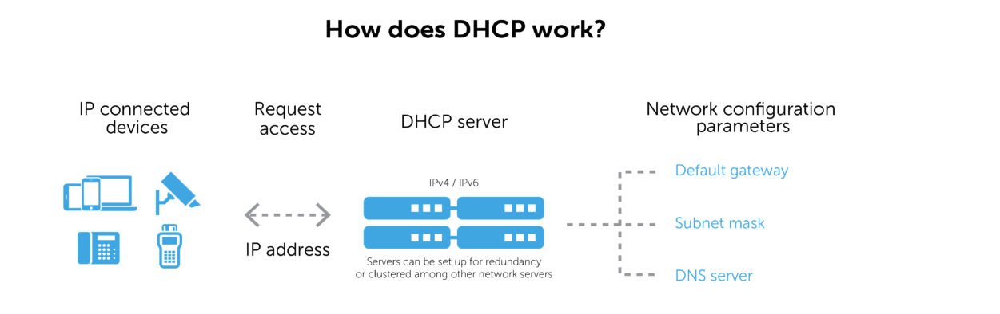

## What is network latency?
Latency is a measure of delay.  In a network, latency measures the time it takes for some data to get to its destination across the network

in short word Latency => responce time form server

details: [Latency](https://www.sas.co.uk/blog/what-is-network-latency-how-do-you-use-a-latency-calculator-to-calculate-throughput)

## OSI Model(Open Systems Interconnection Model)

Details: [OSI](https://www.cloudflare.com/learning/ddos/glossary/open-systems-interconnection-model-osi/)
## Why OSI model developed?

The OSI model has been developed so that each process can communicate with each other processes.
Details: [OSI Model](https://www.giac.org/paper/gsec/1417/osi-model-overview/102634)

## IPC(interprocess communication) linux karnel API.
Interprocess communication (IPC) is a set of programming interfaces that allow a programmer to coordinate activities among different program processes that can run concurrently in an operating system.

## What is NIC?
network interface card (NIC) is a hardware component connected a computer over a network.without NIC the  computer cannot be connected over a network.

There 2 type of NIC
 1. Internal Network Cards
 2. External Network Cards

## About mac?
Media access control address(mac): media access control address (MAC address) is a unique identifier assigned to a network interface controller (NIC) for use as a network address in communications within a network segment.

## Data Transfer Rate(DTR)
The data transmission rate is the volume of data transmitted over a transmission channel or via a data interface within a specified unit of time. The units used for this are baud or bits/s.

## Bandwidth
The maximum amount of data transmitted over an internet connection in a given amount of time.

## About PORT in network?

In computer network, port is a virtual point where network connection is start and end or communication endpoint.

In general, process and port one to one mapping all time why?

Because, one or more process can be communicating with each other with reliable and stable.The process could be same computer or different computer.

TCP communication needs two ports
  1. source port - send the data or packet and receive the acknowledgement from the receiver
  2. destination port - receive the data and packet and send the acknowledgement to sender.

TCP port range: 1024 to 49151

## what is ring buffer?
Ring Buffer are shared buffers between the device driver and network interface card (NIC), which is store incoming packets until the device driver can process them.The ring buffer also known as circular buffer.

Ring buffers exist on both the receive (rx) and transmit (tx) side of each interface on the firewall.

We can check ring buffer size by command
    `HostName> show interface NAME_of_PHYSICAL_INTERFACE rx-ringsize`

## NAT Gateway
A NAT gateway is a Network Address Translation (NAT) service. we can use a NAT gateway so that instances in a private subnet can connect to services outside VPC(virtual private cloud) but external services cannot initiate a connection with those instances. 

For Details [NAT](https://docs.aws.amazon.com/vpc/latest/userguide/vpc-nat-gateway.html)

## Stateless Protocol
Stateless Protocols are the type of network protocols in which Client send request to the server and server response back according to current state. It does not require the server to retain session information or a status about each communicating partner for multiple request.

In short word: it doesn't remember any request or response.

## Stateful Protocol
Stateful Protocol If client send a request to the server then it expects some kind of response, if it does not get any response then it resend the request.

## HTTP, HTTPS

HTTP(Hypertext Transfer Protocol): HTTP is an application-layer protocol that runs over TCP.

HTTPS(Hypertext Transfer Protocol Secure):HTTPS transmits its data security using an encrypted connection over http.it's created by Netscape Communications back in 1994.

## TCP handshake
TCP uses a three-way handshake to establish a reliable connection.Which is used in TCP/IP network to  make connection between to server and client.

Sharing data or packets from one computer(client or browser) to another computer(server) will require some information.
  1. Data
  2. Source IP(SI)
  3. Destination IP(DI)
  4. Source IP Port
  5. Destination IP port

After reaching in server it's process the request and gives the responce.

## Switch and Router?

Switch: Switches are networking devices operating at layer 2 or a data link layer of the OSI model.Switches are key building blocks for any network

Router: The router is a physical or virtual internetworking device that is designed to receive, analyze, and forward data packets between computer networks.

##  What is DHCP?
DHCP is a network management protocol. A client device (or DHCP client), such as a laptop, joins a network and requests an IP address. The request is made to a DHCP server.

## Egress and Ingress

Egress: Egress refers to data leaving a network in transit to an external location(the action of going or coming out)

Ingress: Ingress traffic is composed of all the data communications and network traffic originating from external networks.In other words, ingress refers to traffic that comes from outside an organization's network and is transferred into it.

[Networking Fundamentals in practicalnetworking]((https://www.practicalnetworking.net/index/networking-fundamentals-how-data-moves-through-the-internet/)

