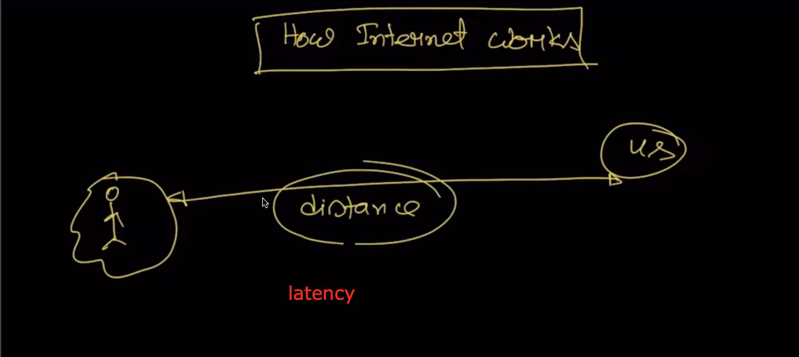
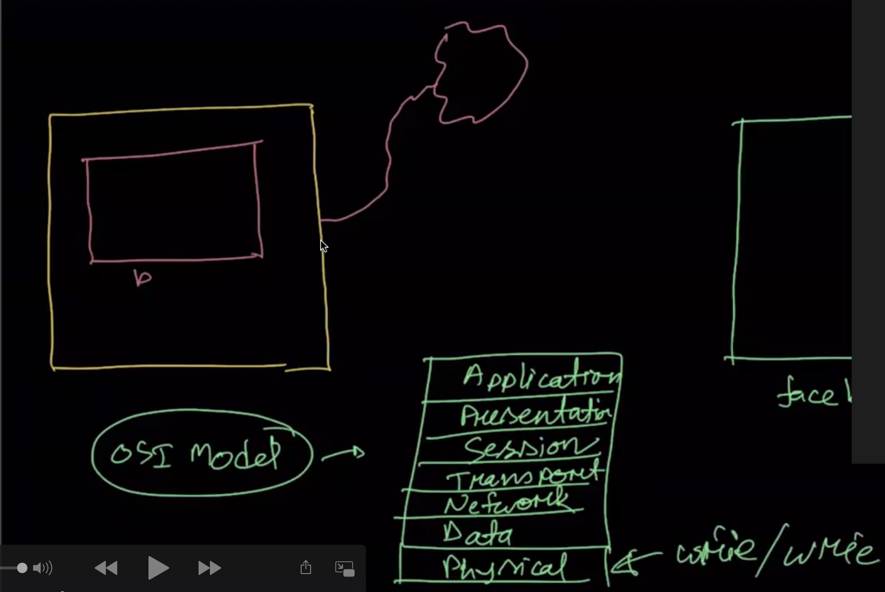
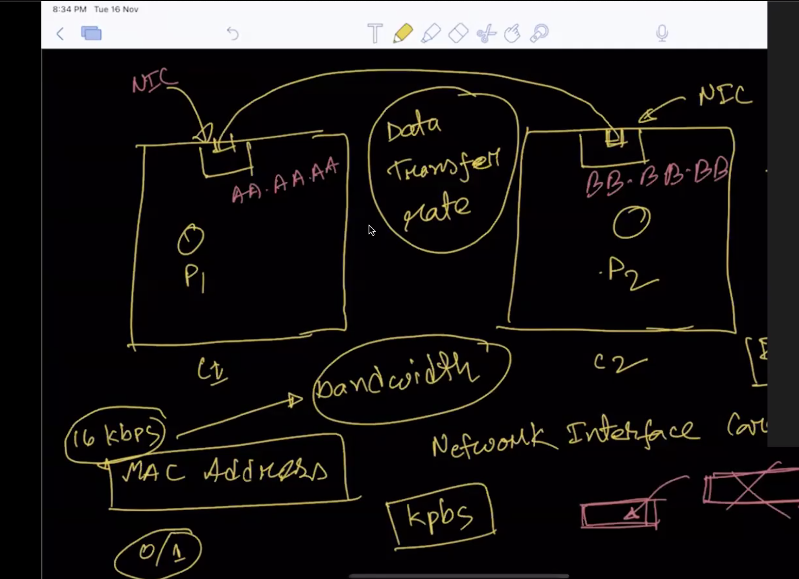
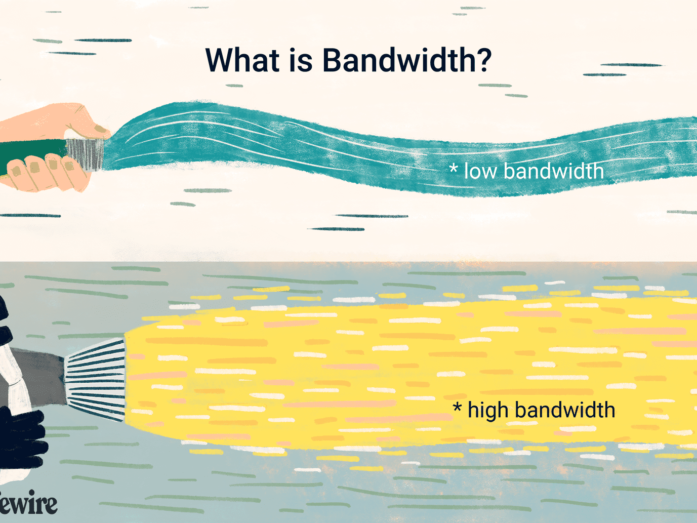
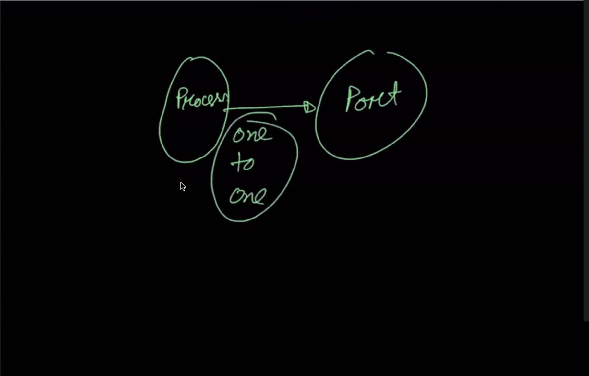

## What is network latency?
Latency is a measure of delay.  In a network, latency measures the time it takes for some data to get to its destination across the network

in short word Latency => responce time form server

details: [Latency](https://www.sas.co.uk/blog/what-is-network-latency-how-do-you-use-a-latency-calculator-to-calculate-throughput)

## OSI Model(Open Systems Interconnection Model)

Details: [OSI](https://www.cloudflare.com/learning/ddos/glossary/open-systems-interconnection-model-osi/)
## Why OSI model developed?

The OSI model has been developed so that each process can communicate with each other processes.
Details: [OSI Model](https://www.giac.org/paper/gsec/1417/osi-model-overview/102634)

## IPC(interprocess communication) linux karnel API.
Interprocess communication (IPC) is a set of programming interfaces that allow a programmer to coordinate activities among different program processes that can run concurrently in an operating system.

## What is NIC?
network interface card (NIC) is a hardware component connected a computer over a network.without NIC the  computer cannot be connected over a network.

There 2 type of NIC
 1. Internal Network Cards
 2. External Network Cards

## About mac?
Media access control address(mac): media access control address (MAC address) is a unique identifier assigned to a network interface controller (NIC) for use as a network address in communications within a network segment.

## Data Transfer Rate(DTR)
The data transmission rate is the volume of data transmitted over a transmission channel or via a data interface within a specified unit of time. The units used for this are baud or bits/s.

## Bandwidth
The maximum amount of data transmitted over an internet connection in a given amount of time.

## About PORT in network?
In computer network, port is a virtual point where network connection is start and end or communication endpoint.

In general, process and port one to one mapping all time why?
Because, one or more process can be comunicating with each other with reliable and stable.The process could be same computer or different computer.

