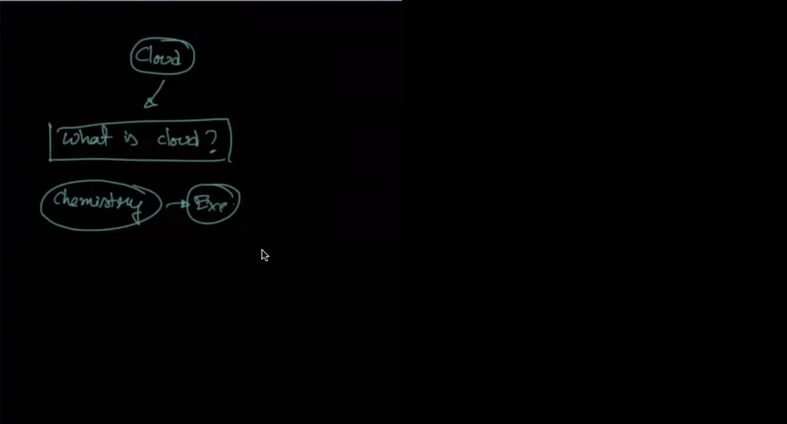
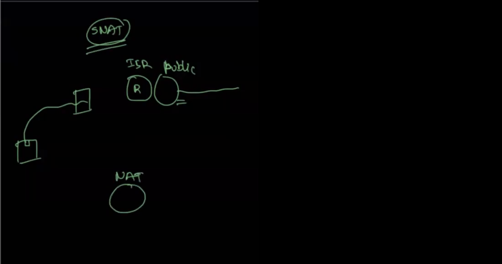
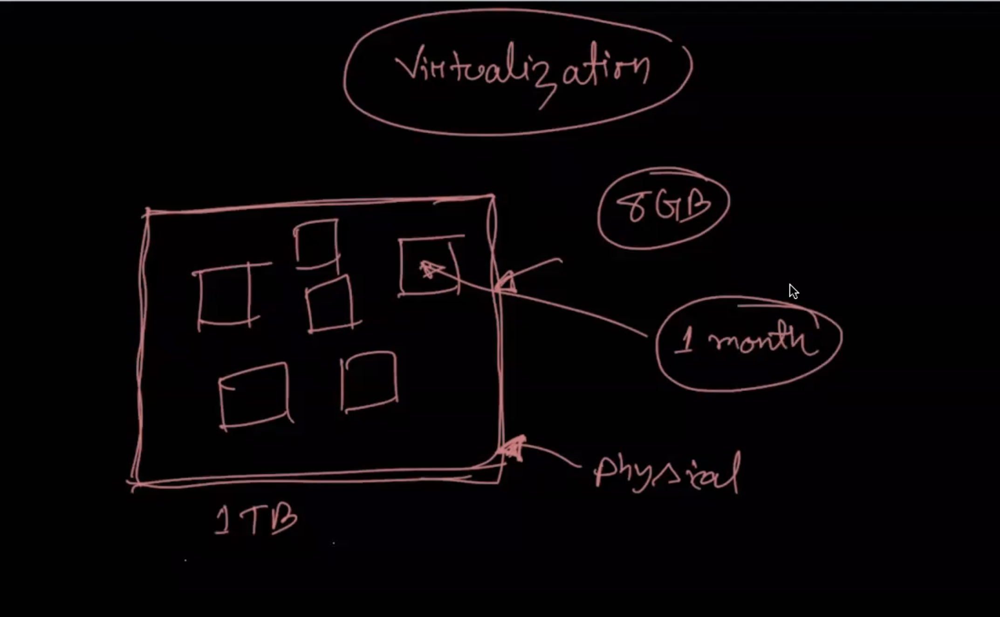
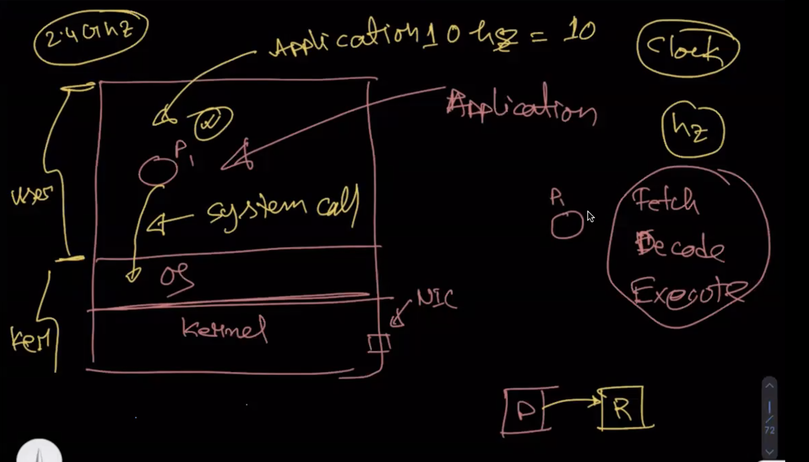
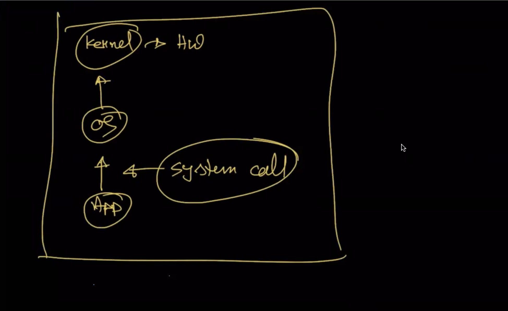
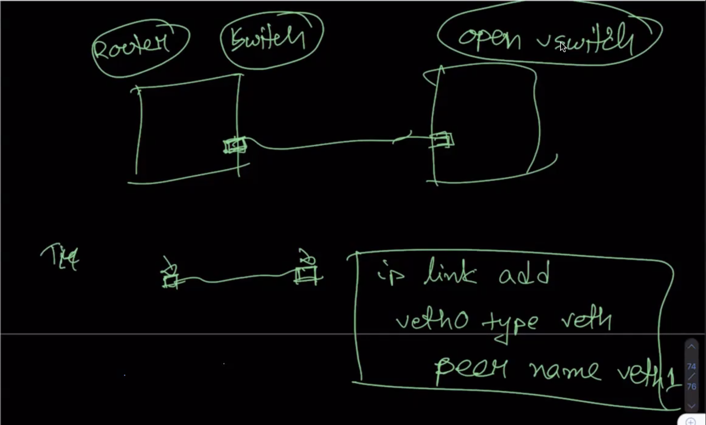
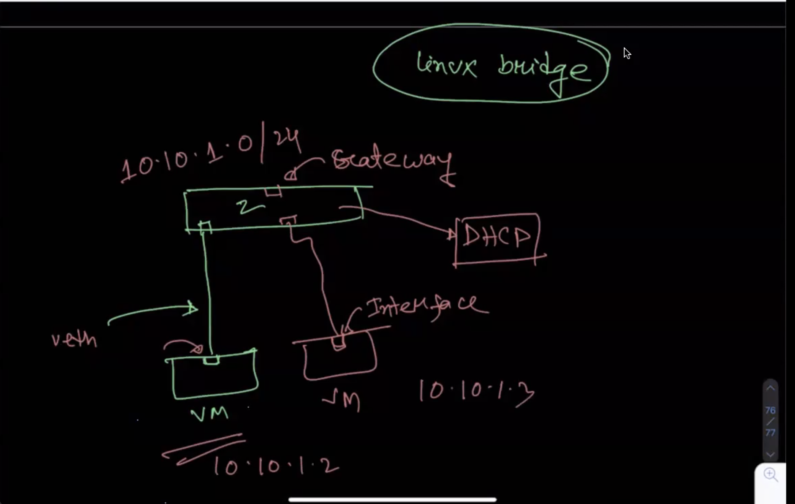
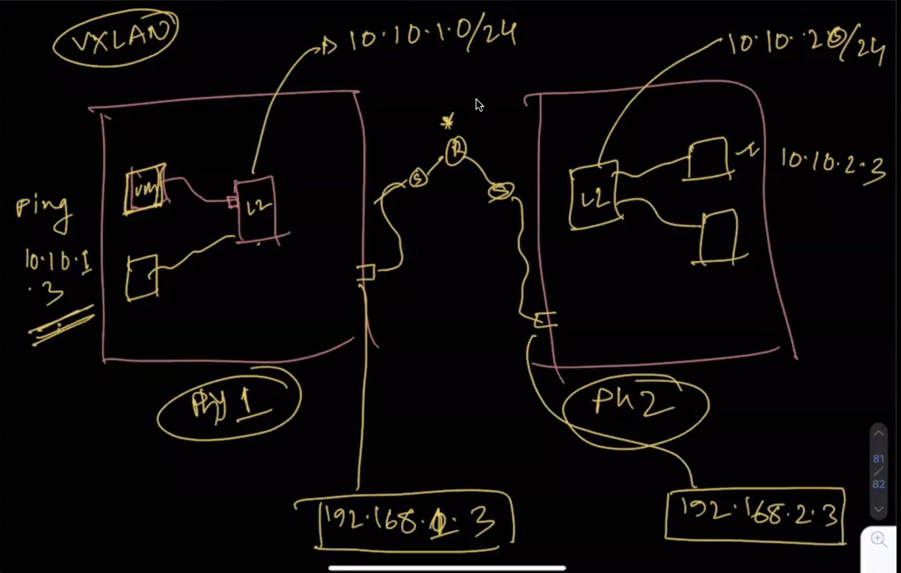
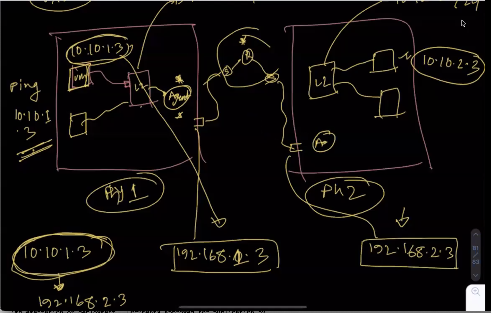
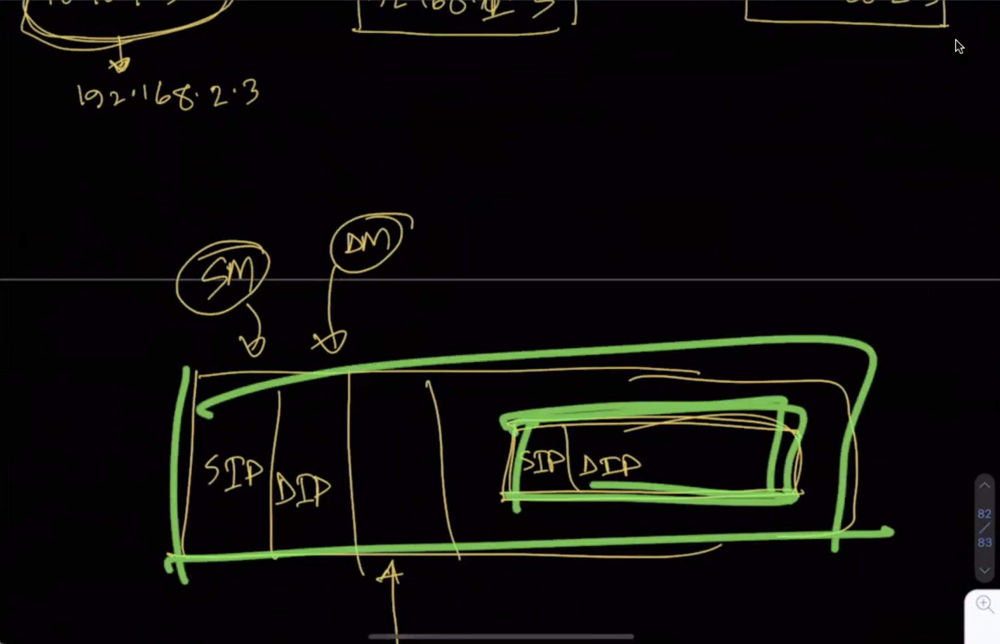

## What is cloud?
"The cloud" means a servers which is accessed over the Internet, and the software and databases or ther process that run on those servers. Cloud servers are located in data centers all over the world.

cloud details: [cloud](https://www.cloudflare.com/en-gb/learning/cloud/what-is-the-cloud/)

## Openstack
Openstack [Openstack](https://docs.openstack.org/install-guide/get-started-logical-architecture.html)

# SNAT(Source Network Address Translation)
Secure or Source network address translation is network address translation technique that enable private network security or source by providing a public ip (Internet protocol) address to remote or host users or system.It allows multiple computers that connected within network with single private local area network to using a singler ip address to acess the internet.In general SNAT work network environment.

## What is virtualization?
Virtualization is technique that created multiple physical layer over single physical layer that can be used by multiple physical machine or sharing the resource.

Virtualization Details [virtualization](https://www.ibm.com/cloud/learn/virtualization-a-complete-guide)

## How virtualization work?

Physical layer() have some major component.Those ase  
        - application : when run application in usernamespace it's call different OS API.The OS api called System api.Application run always run usernamespace.   
        - os: make connection between application and karnel.  
        - karnel: manage the resource.  

how execution processor:   
    - fetch : is the operation which receives instructions from program memory from a systems RAM.   
    - Decode: the instruction is converted to understand which other parts of the CPU are needed to continue the operation. This is performed by the instruction decoder  
    - Execute: perfomr the operation and keep that Each part of the CPU that is needed is activated to carry out the instructions.  

Work flow: application->os->karnel  

## KVM 
KVM (for Kernel-based Virtual Machine) is a full virtualization solution for Linux on x86 hardware containing virtualization extensions (Intel VT or AMD-V). It consists of a loadable kernel module, kvm.ko, that provides the core virtualization infrastructure and a processor specific module, kvm-intel.ko or kvm-amd.ko.

[KVM link 1](https://www.linux-kvm.org/page/Main_Page)  
[KVM link 2](https://www.redhat.com/en/topics/virtualization/what-is-KVM)  

## Openvswitch:
Open vSwitch is a multilayer software switch licensed under the open source Apache 2 license. Our goal is to implement a production quality switch platform that supports standard management interfaces and opens the forwarding functions to programmatic extension and control.

[ Openvswitch ](https://docs.openvswitch.org/en/latest/intro/what-is-ovs/#overview)

## Linux bridge
linux bridge: Linux bridge behaves like a network switch. it's connect multiple vm in same network.
Every VM is connect to hub by veth(virtual Ethernet).

Linux bridge details: [ Linux bridge ](https://www.ibm.com/docs/en/linux-on-systems?topic=choices-using-linux-bridge)  
veth detail here: [veth](https://man7.org/linux/man-pages/man4/veth.4.html)

## Domain collision?
The collision domain defines the set of devices on which their frames could collide. It is a network segment connected by a shared medium or using repeaters where real-time data transmissions collide.

[Domain collision](https://www.geeksforgeeks.org/collision-domain-and-broadcast-domain-in-computer-network/)

## VXLAN
VXLAN is an encapsulation protocol that provides data center connectivity using tunneling to stretch Layer 2 connections over an underlying Layer 3 network.

Details VXLAN: [VXLAN link 1](https://www.juniper.net/us/en/research-topics/what-is-vxlan.html), [VXLAN link 2](https://datatracker.ietf.org/doc/html/rfc7348)

