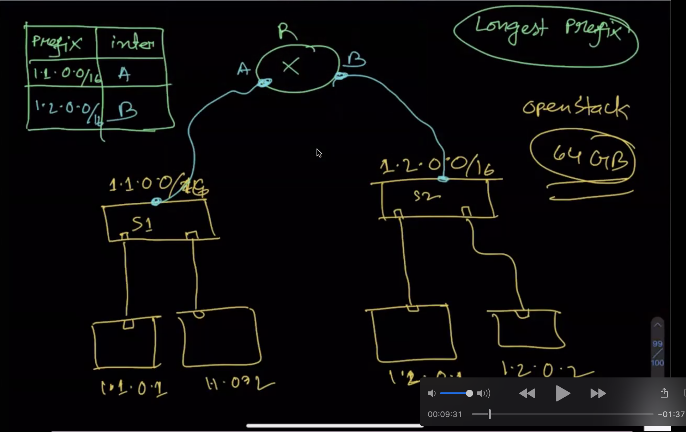
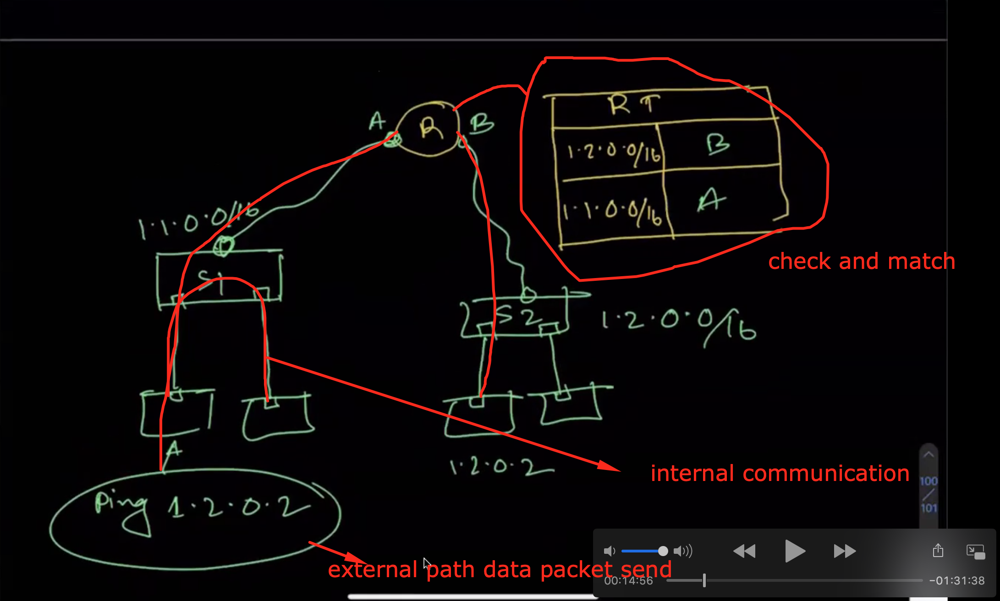
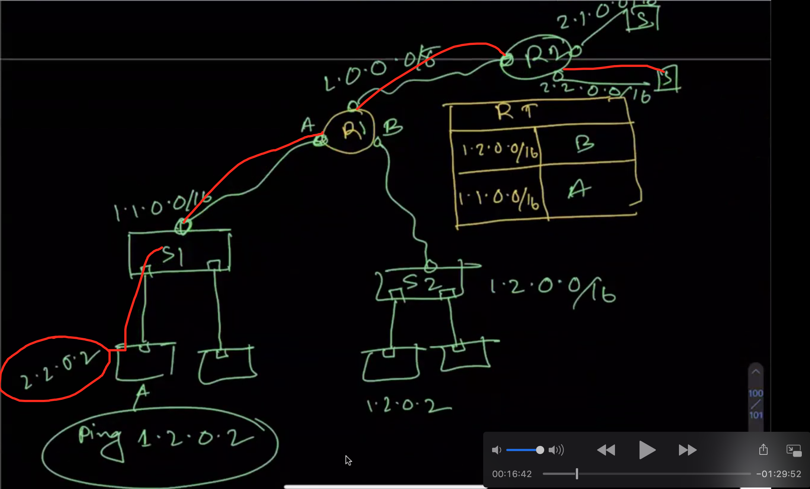

## How data packet transfer one switch to another switch?  

We have 2 swicth S1 and S2 and those also have ip adress   
  - s1: 1.1.0.0/16 (here 16 is ip host limitation 2^16 ip will share)  
  - s2:1.2.0.0/16  

And those switch also have VM(virtual machine)  

        -------------------> VM1(1.1.0.1)
        | (connect by veth)    
 - s1: --  
        |  
        -------------------> VM2(1.1.0.2)    
        -------------------> VM3(1.2.0.1)     
        |(connect by veth)  
 - s2: --    
        | (connect by veth)      
        -------------------> VM4(1.2.0.2)    

For check data transmission: 

ping 1.2.0.1(that mean send data packet S2 at VM1) for sending data packet it's matched tha longest prefix table with prefix with interface(here interface physical device like switch)

Prefix Table

| Prefix  | Prefix               |
| --------| -------------------  |
| 1.1.0.0/16  | `npm run build` 
| 1.2.0.0/16  | `npm run start`

If we extended the communication path to adding one Router(R2) and R2 also have 2 swicth.If we ping the the IP

ping: 2.2.0.2 and traverse the path as bellow

## Longest prefix

An IP longest prefix match process adds a new route entry into the forwarding table, given an IP address and a prefix that includes 32 bits.

Details: [Longest prefix](https://www.juniper.net/documentation/us/en/software/junos/static-routing/topics/ref/statement/longest-match-next-hop-edit-static-routing-options.html)

