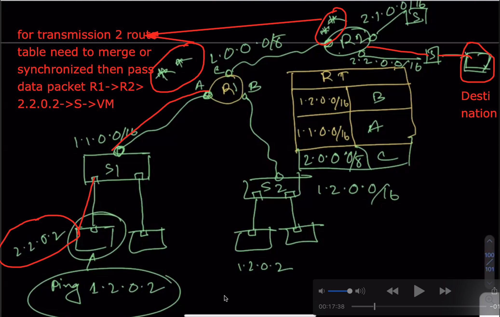
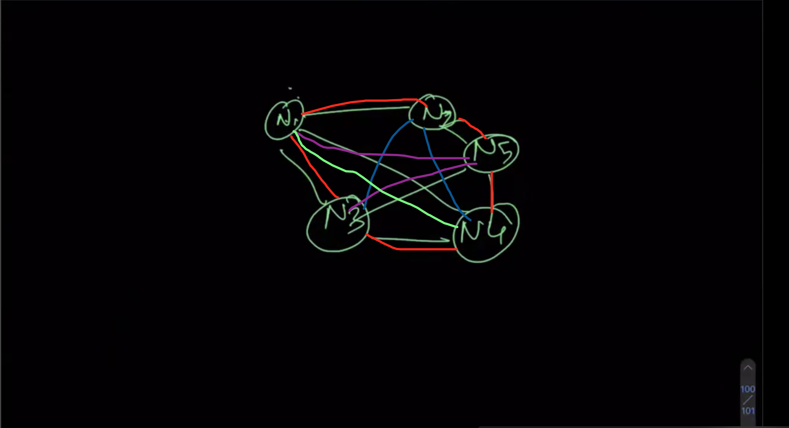
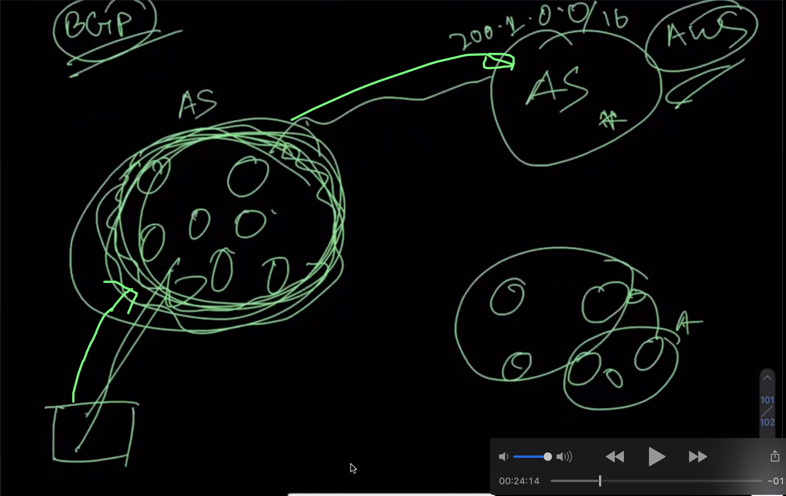
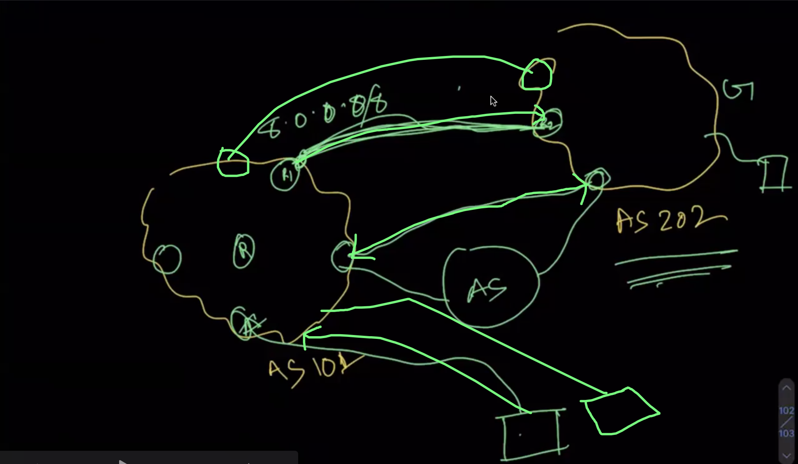
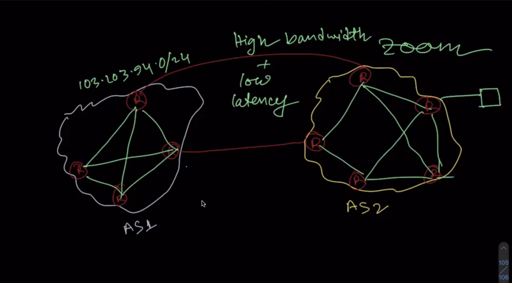
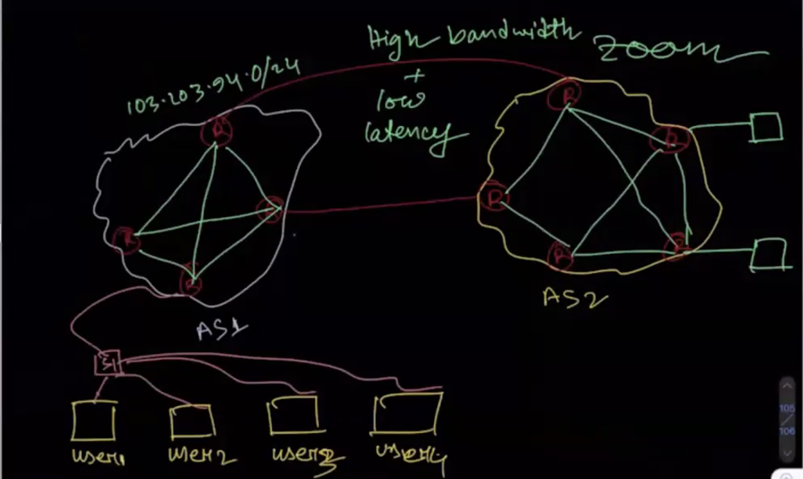
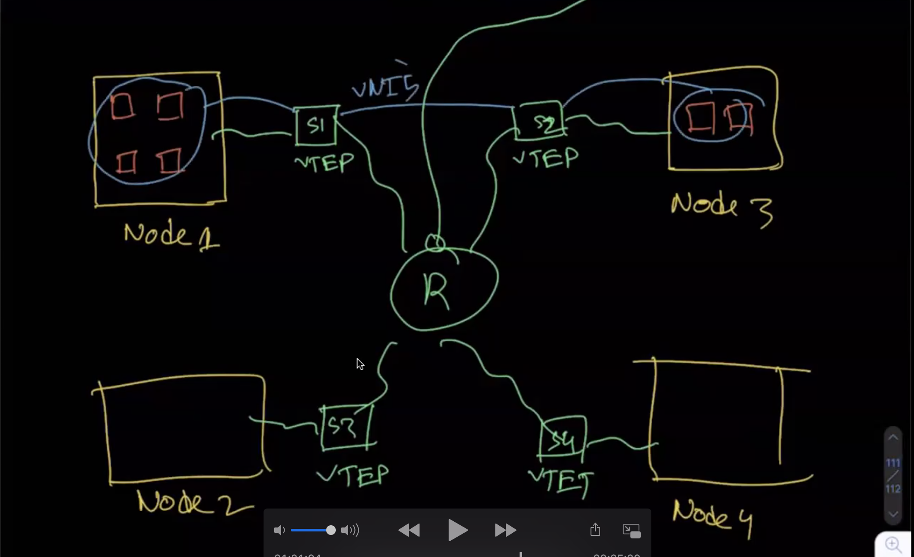
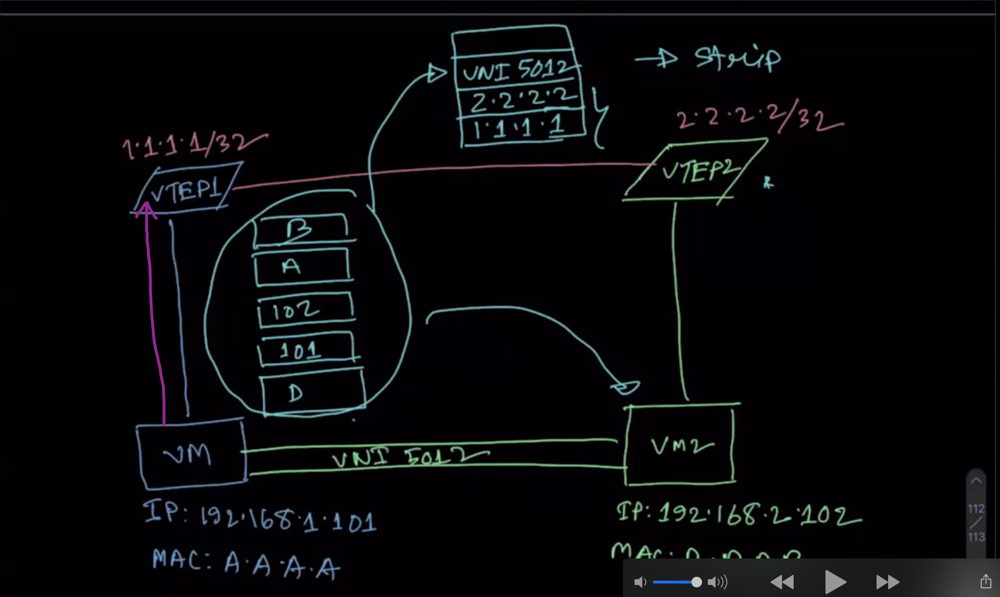

## How data packet traverse one network to another network or internal network?  

We have 2 swicth S1 and S2 and those also have ip adress   
  - s1: 1.1.0.0/16 (here 16 is ip host limitation 2^16 ip will share)  
  - s2:1.2.0.0/16  

And those switch also have VM(virtual machine)  

|        -------------------> VM3(1.2.0.1)     
|        |(connect by veth)  
| - s2: --    
|        | (connect by veth)      
|        -------------------> VM4(1.2.0.2)    
|        -------------------> VM3(1.2.0.1)     
|        |(connect by veth)  
| - s2: --    
|        | (connect by veth)      
|        -------------------> VM4(1.2.0.2)    

For check data transmission: 

ping 1.2.0.1(that mean send data packet S2 at VM1) for sending data packet it's matched tha longest prefix table with prefix with interface(here interface physical device like switch)

Prefix Table

| Prefix      | Interface           |
| ------------| ------------------- |
| 1.1.0.0/16  |  A
| 1.2.0.0/16  |  B

If we extended the communication path to adding one Router(R2) and R2 also have 2 swicth.If we ping the the IP

ping: 2.2.0.2 and traverse the path as bellow

## Longest prefix

An IP longest prefix match process adds a new route entry into the forwarding table, given an IP address and a prefix that includes 32 bits.

Details: [Longest prefix](https://www.juniper.net/documentation/us/en/software/junos/static-routing/topics/ref/statement/longest-match-next-hop-edit-static-routing-options.html)

## Traveling salesman problem 

The traveling salesman problem (TSP) is an algorithmic problem tasked with finding the shortest route between a set of points and locations that must be visited.

Ex: Many order's are coming to Foodpanda. The food panda man has to deliver these orders to the specified place. The place is N1, N2, N3, N4, N5 (those are city place ).Each city place are inerconnected with others. The Foodpanda man will visit those places will short time and low cost after that foodpanda man will retrun his destination.This is the traveling salesman problem alogoritham(TSP).

Complexity: There is no polynomial solution.

## BGP(Border Gateway Protocol)?

Border Gateway Protocol (BGP) is the postal service of the Internet. BGP gateway protocol that enables the internet to exchange routing information between autonomous systems (AS). As networks interact with each other, they need a way to communicate.

  - bgp peering: To establish point-to-point connections between peer autonomous systems (ASs).

check AS area: [AS area](bgp.he.net)

## Vxlan?

