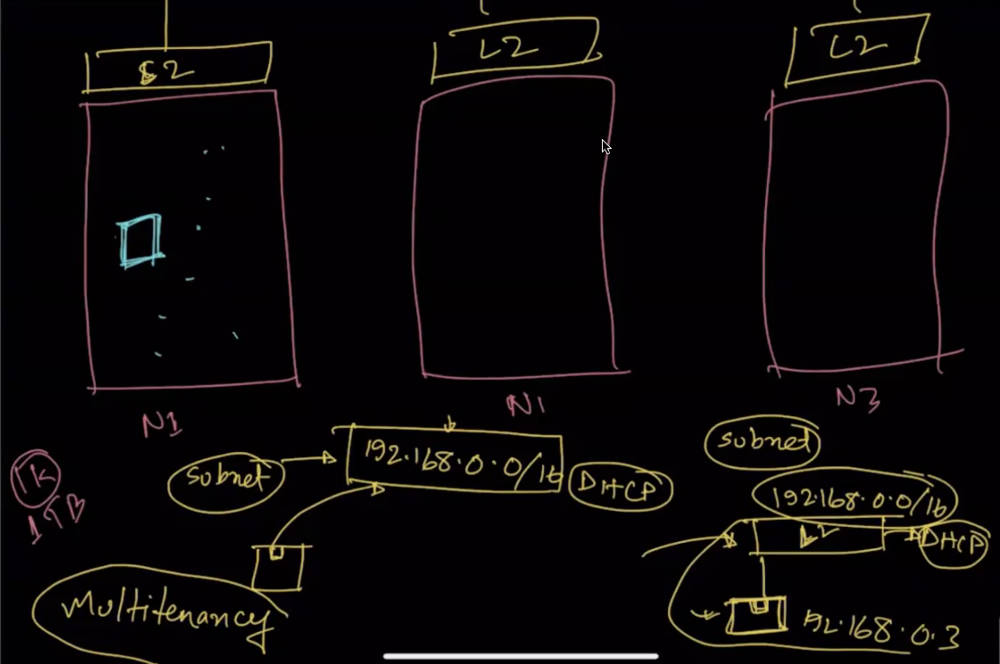
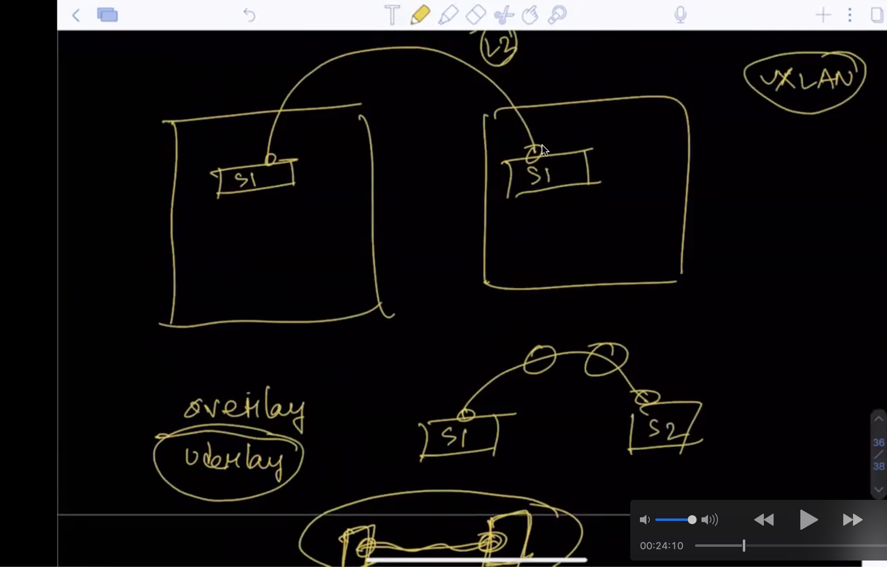

## Multitenancy

Multitenancy is a form of cloud architecture where multiple clients of a single cloud vendor share the same computing resources.

Multitenancy Details: 

## Subnet

A subnet is a network within a network.In other words, A subnet is segmented piece of a larger network which are logical partition of an IP network into multiple network.

Here, we have 3 node (means large data center) N1, N2, N3. Each node have layer 2 device and every node inter connected with each other with switch like(S1, S2, S3) but we condiser that the switch is invisiable.Onething, Every node is same network by subnet.

In N1 and N2 node we lunch a 2 separate VM.But the VM is created by same user.But User want to access or connect in same network that user can access easily.

For that, We need to create network the network is created by vxlan by VNI.The connected wire is called VNI(Vxlan network Identifire).

In summarized, When we lunched any VM by user every time create a virtual switch (by openvswitch) in same network that can access easily by same user.

In short, Vxlan create network febric or overlay with node in VM to comunicate with other. 

