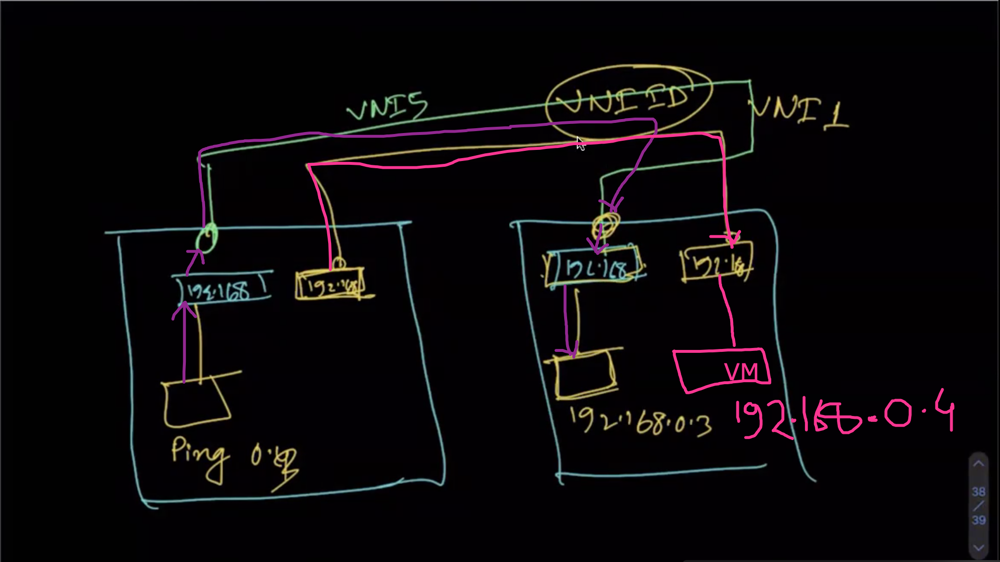
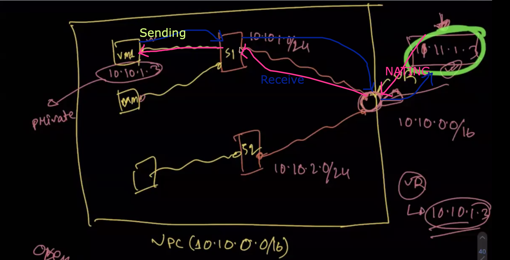

## Multitenancy

Multitenancy is a form of cloud architecture where multiple clients of a single cloud vendor share the same computing resources.

Multitenancy Details: 

## Subnet

A subnet is a network within a network.In other words, A subnet is segmented piece of a larger network which are logical partition of an IP network into multiple network.

Here, we have 3 node (means large data center) N1, N2, N3. Each node have layer 2 device and every node inter connected with each other with switch like(S1, S2, S3) but we condiser that the switch is invisiable.Onething, Every node is same network by subnet.

In N1 and N2 node we lunch a 2 separate VM.But the VM is created by same user.But User want to access or connect in same network that user can access easily.

For that, We need to create network the network is created by vxlan by VNI.The connected wire is called VNI(Vxlan network Identifire).

In summarized, When we lunched any VM by user every time create a virtual switch (by openvswitch) in same network that can access easily by same user.

In short, Vxlan create network febric or overlay with node in VM to comunicate with other. 

## Packet traverse VNI?
VXLAN is an L2 overlay over an L3 network. Each overlay network is known as a VXLAN segment and identified by a unique 24-bit segment ID called a VXLAN Network Identifier (VNI).  Only hosts on the same VNI are allowed communicate with each other.  Hosts are identified uniquely by the combination of their MAC addresses and VNI.  As such it is possible to have duplicate MAC addresses in different VXLAN Segments without issue, but not in the same VXLAN segments.

Vxlan Data tranmission packet header

  - Ethernet Header
    . Destination Address - This is set to the MAC address of the destination VTEP.
    . Source Address - This is set to the MAC address of the source VTEP.
    . VLAN - An optional field that is designated by an ethertype of 0×8100 and contains an associated VLAN ID tag.
    . Ethertype - This is set to 0×0800 (IPv4). IPv6 support is currently in draft status

  - IP Header
    . Protocol
    . Source IP
    . Destination IP

  - UDP Header
    . Source Port - Set by originating VTEP
    . VXLAN Port - IANA assigned VXLAN Port
    . UDP Checksum - This should be set to 0×0000. If not set to 0x0000, then the receiving VTEP should verify the checksum. If not correct, frame shall be dropped.

  - VXLAN Header
    . VXLAN Flags - Reserved bits. Bit 3 set to 1 to indicate valid VNI
    . VNI - VXLAN Network Identifier - 24 bit field.
    . Reserved - Bit flags set to zero and reserved for future use

Details: [ packet header ](https://www.cisco.com/c/en/us/products/collateral/switches/nexus-9000-series-switches/guide-c07-734107.html)

## VPC design with VM and packet transfer with VM to Internet and vice-versa

