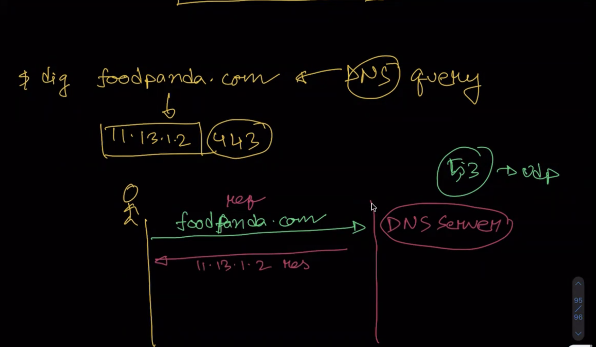
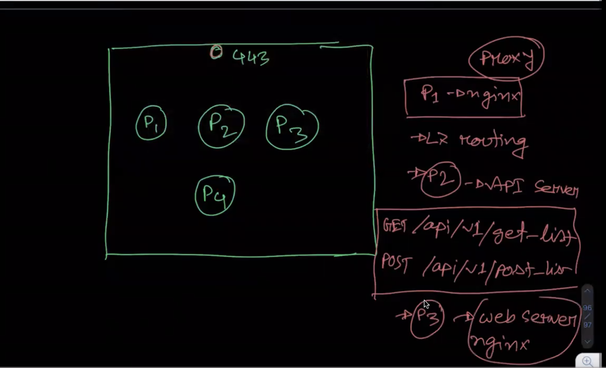
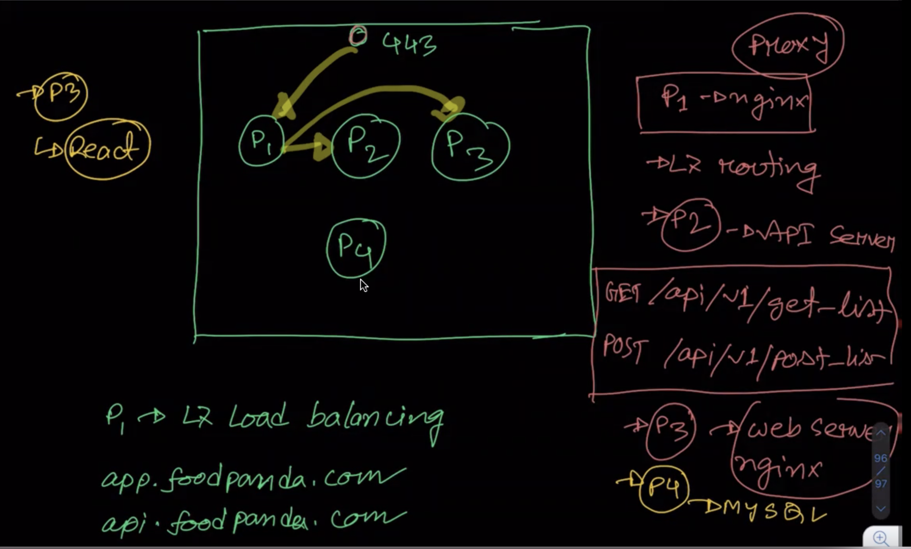
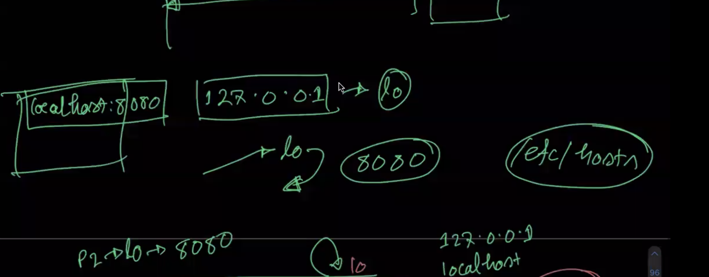
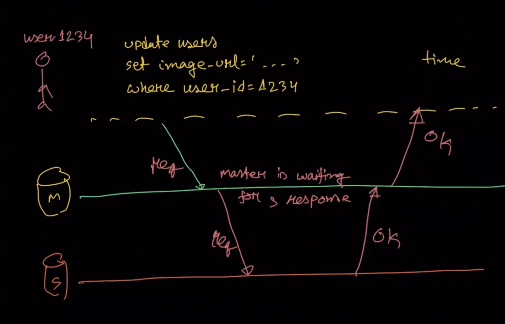

## About DNS(Domain Name System)?

Domain Name System (DNS) is the phonebook of the Internet. Humans access information online through domain names, like exmaple.com or espn.com. Web browsers interact through Internet Protocol (IP) addresses. DNS translates domain names to IP addresses so browsers can load Internet resources.dns work in 53 port.

Load balancing is the practice of distributing traffic across more than one server to improve performance and availability. Organizations use different forms of load balancing to speed up both websites and private networks. Without load balancing, most Internet applications and websites would not handle traffic effectively or function correctly.

For Example, Every device connected to the Internet has a unique IP address which other machines use to find the device. DNS servers eliminate the need for humans to memorize IP addresses such as 192.168.1.1.

For more details about dns (DNS)[https://www.cloudflare.com/en-gb/learning/dns/what-is-dns/]  
[aws-dns](https://aws.amazon.com/route53/what-is-dns/)

## ngnix?

Nginx is web server which is process the request and send responce based on request.  

Web Server: Whenever we open your browser, type a URL and then click enter. Basically, we are requesting the contents of that URL, after accepting our request, send the contents of that URL back as a response.

In other words, Web Servers are computers that deliver the requested web pages. Every web server has an IP address and domain name. 

There area 2 types of web server   
    - shared web server  
    - dedicated webserver  

For Nginx, It(Nginx) is a dedicated web server that has solved efficiency issues and provided us with an optimum way to handle 1000s of requests concurrently.  
Nginx Web server for used as reverse proxy, caching, and load balancing.   

Reverse proxy: reverse proxy accepts a request from a client, forwards the request to a server that can fulfill it, and returns the response from the server to the client.  

Caching: Caching is a technique that stores a copy of a given resource and serves it back when requested. When a web cache has a requested resource in its store, it intercepts the request and returns its copy instead of re-downloading from the originating server.

Load balancer: load balancer distributes the incoming client requests to a group of servers, in which it can handle concurrent requests without experiencing load on a particular server.  

Nginx Details: (nginx-we-server)[https://www.nginx.com/]

Every Application or system have some process or service need to run, For 
 - Web server or application server(nginx as p1 process)  
 - API server ( p2 process )  
 - proxy server (nginx p3 process )  
 - mysql server ( p4 process )  

## Layer 7 routing or load balancing

Layer 7 or Content Based Routing capable load balancer to meet the same domain requirement.Layer 7 load balancing operates at the application level, using protocols such as HTTP and SMTP to make decisions based on the actual content of each message. Instead of merely forwarding traffic unread, a layer 7 load balancer terminates network traffic, performs decryption as needed, inspects messages, makes content-based routing decisions, initiates a new TCP connection to the appropriate upstream server, and writes the request to the server.

Layer 7 Details: (Layer 7)[https://www.nginx.com/resources/glossary/layer-7-load-balancing/]

  

## Loopback Interface

A loopback interface is a virtual interface that is always up and reachable as long as at least one of the IP interfaces on the switch is operational. As a result, a loopback interface is useful for debugging tasks since its IP address can always be pinged if any other switch interface is up.

Details loopback interface: (loopback-interface)[https://www.juniper.net/documentation/en_US/junos/topics/concept/interface-security-loopback-understanding.html]

 

## What Is Scalability?
Scalability describes a system’s elasticity and it's describes our system’s ability to adapt to change and demand. Good scalability protects you from future downtime and ensures the quality of our service.

If we are running a website, web service, or application, its success hinges on the amount of network traffic it receives. It is common to underestimate just how much traffic our system will incur, especially in the early stages. This could result in a crashed server and/or a decline in our service quality. 
    - Horizontal Scaling
    - Vertical Scaling

Horizontal Scaling: Horizontal scaling refers to adding additional nodes or machines to our infrastructure to cope or adjust with new demands. If we are hosting an application on a server and find that it no longer has the capacity or capabilities to handle traffic, adding a new server it's solved the probelm.

Vertical Scaling: Vertical scaling describes adding additional resources to a system so that it meets demand or capabilities to handle traffic.vertical scaling adding more power at current machines or system. It upgrading the cpu like memory, storage, or network speed or others.

Details about Horizontal & Vertical Scaling:  (Horizontal-Vertical-Scaling)[https://www.cloudzero.com/blog/horizontal-vs-vertical-scaling]

## Domain Name System (DNS) based load balancing

DNS-based load balancing is a specific type of load balancing that uses the DNS to distribute traffic across several servers. It does this by providing different IP addresses in response to DNS queries. Load balancers can use various methods or rules for choosing which IP address to share in response to a DNS query.

Details of DNS based load balancing: (DNS based load balancing)[https://www.cloudflare.com/en-gb/learning/performance/what-is-dns-load-balancing/]

## Time-to-live (TTL)

Time to live (TTL) refers to the amount of time or “hops” that a packet is set to exist inside a network before being discarded by a router. TTL is also used in other contexts including CDN caching and DNS caching.

Details about ttl: (ttl)[https://www.cloudflare.com/en-gb/learning/cdn/glossary/time-to-live-ttl/]

## Replication
Replication means keeping a copy of the same data on multiple machines that are connected via a network.
There are may reasons to replicate data. some are bello  
    • To keep data geographically close to your users (and thus reduce latency)  
    • To allow the system to continue working even if some of its parts have failed  
    (and thus increase availability)  
    • To scale out the number of machines that can serve read queries (and thus  
    increase read throughput)  

There area  popular algorithms for replicating changes between nodes
    - single-leader,   
    - multi-leader, and   
    - leaderless replication  

Replica: Each node that stores a copy of the database is called a replica.

leader-based replication: Every write to the database needs to be processed by every replica; otherwise, the rep‐
licas would no longer contain the same data. The most common solution for this is
called leader-based replication (also known as active/passive or master–slave replica‐
tion) 

## synchronous replication
Synchronous replication is a process for simultaneous updates of multiple repositories often used with a storage area network or wireless network or other segmented system. In synchronous replication, the technology is writing data to two systems at once, rather than one at a time.
For example synchronous: The user send the message to the master and it's waits until slave or replica(replica1, replica2) has confirmed that it received the write before reporting success to the user, and before making the write visible to other clients.

 

## asynchronous replication
asynchronous: In asynchronous replication, When user send the message to the master it' doesn't wait confirmation of slave or replica(replica1, replica2) response from replica.

 

## Connection Polling

Connection pooling is a cache of database connections maintained so that the connections can be reused when future requests to the database are required. Connection pools are used to enhance the performance of executing commands on a database.

## Server

## Multiple Process

## Multiple Server

## Best Fit

## Mysql Replication & Scaling

Book Reff: 
 (Designing Data Intensive Applications chapter-5)[./docs/images/Designing-Data-Intensive-Applications.pdf]   
 (Designing Data Intensive Applications - chapter-10,11, page-start: 550)[./docs/images/High-Performance-MySQL-3rd-Edition-Mar-2012.pdf]

