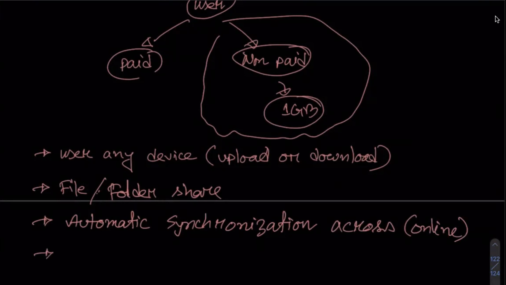
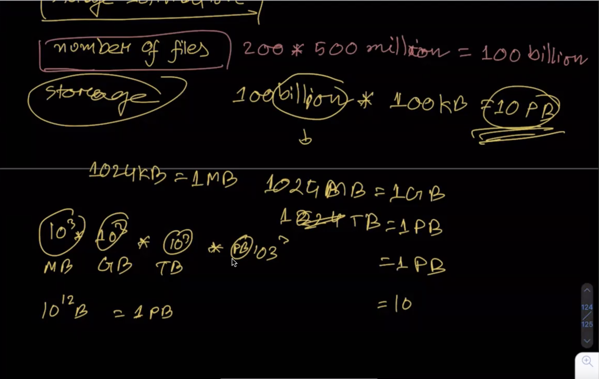
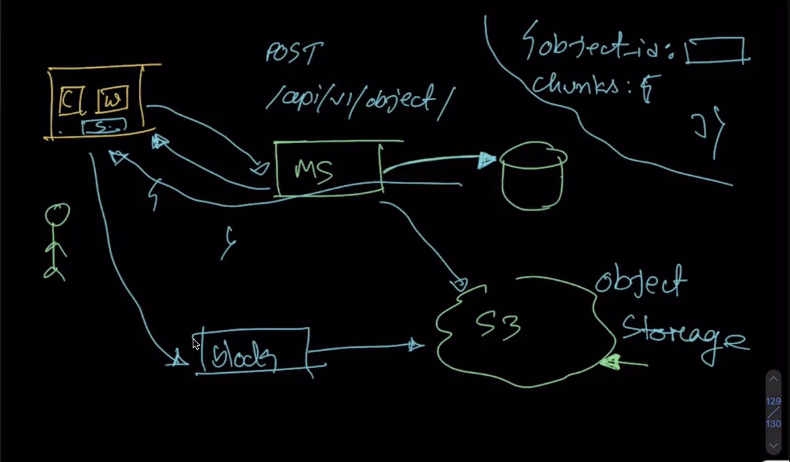
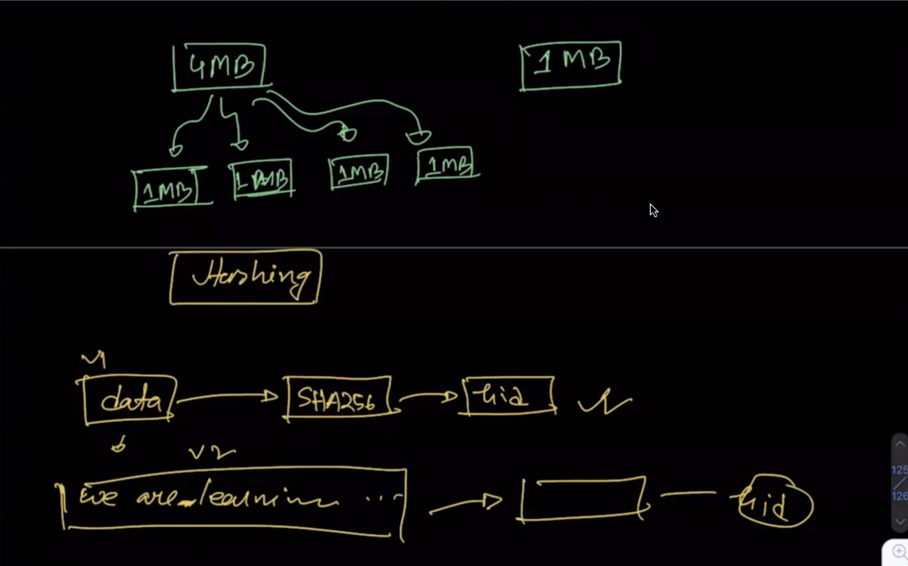
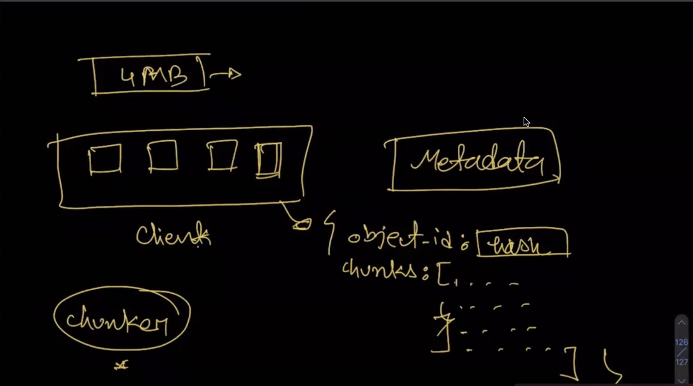

## Core concept of any system Design

1. Requirement analysis  
    - Functional Requirement  
    - Non Functional Requirement  
    - out of scope Functional Requirement  

2. Capacity Estimation  
    - Assumption  
    - Storage manage  

3. Component Design (Some one called Microservice) 

4. Client Component

5. Meta Data service  
    - Blog Info(Details onfo of any object)  

6. Block Service(Block Mean object data or data)

7. Notification Service 

8. DB schema Design

9. API design Like  
    - get object  
    - chunk upload  
    - Download chunk  

10. Performence 

11. Scalability 

12. Security

## Functional Requirement 
User 
    - Paid user
    - Non paid user

Now we consider onlu non paid user  
    - user any device  
    - file folder share  
    - Automatic synchronigation across  
    - offline edit  

Non Functional Requirement
    - Highly Reliable(any file)  
    - Highly abilable  

## Capacity Estimation 

  - 500 millon total user  
  - DAU( Daily active user)  
  - 200 file upload daily user  
  - file size 100kb  
  - active connection (per minit)  

## Meta Data service  

## Storage Estimation  
 - 200x500 = 100 billon(number file)  
 - storage: 100 billon x 100kb = 1000 billon(10pb)( 10^3x10^3x10^3x10^3 = 10^3 )  

## Hasing  
    -> Data -> SHA256 -> hid  

## Chunker ( another service )  

## Consistency  
    - 100kb -> make chunk  => 25  
    - total chunk = 100bx25 ( 2500B ) chunk data  

